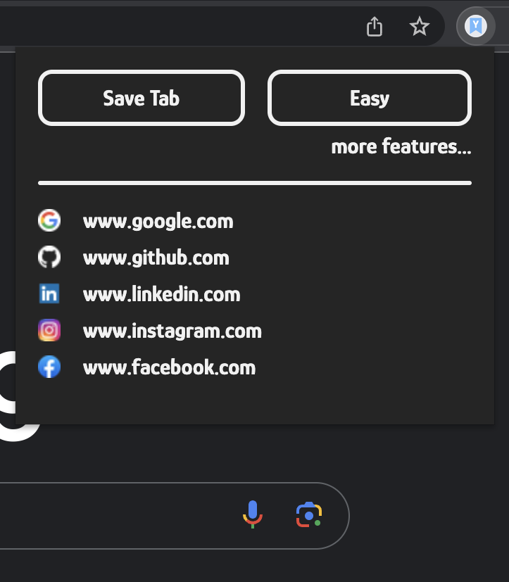

# YABM - Yet Another Bookmark Manager

A chrome extension to quickly store and manage websites.

## Features:
- Save current tab or manually input web address
- Delete bookmarks
- Uses localStorage as a makeshift database.
- Dark and light themes

## Built with:
- HTML
- CSS
- JavaScript
