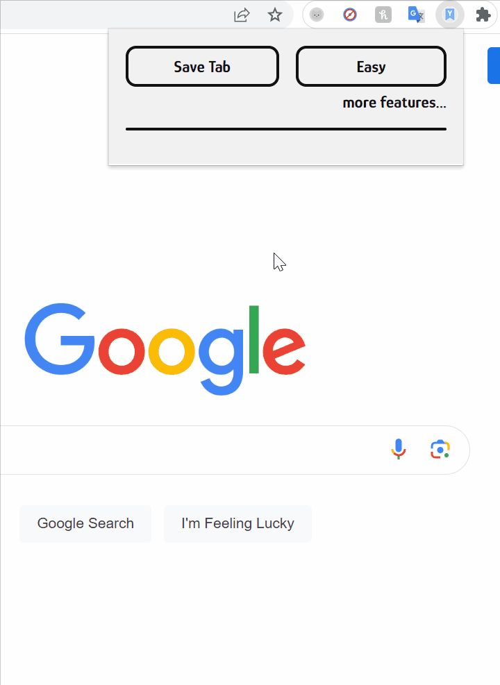

# YABM - Yet Another Bookmark Manager

A chrome extension to quickly store and manage bookmarks.

## Walkthrough:

## Features:
- Save current tab or manually input web address
- Ability to delete bookmarks
- Random link button
- Uses localStorage as a makeshift database
- Dark and light themes

## Built with:
- HTML
- CSS
- JavaScript
- Chrome API
